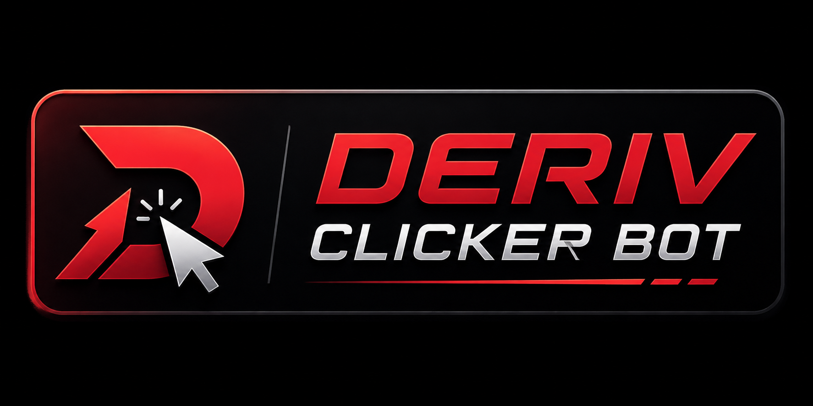

# DerivClickerBot - Bot de Automação para Deriv (Modo Acumulador)

O **DerivClickerBot** é uma plataforma profissional de automação e trading inteligente projetada para a corretora Deriv, focada especificamente na modalidade de contrato **Accumulator** (Acumulador). O sistema combina controle visual via processamento de imagem (OpenCV), integração nativa e assíncrona via API WebSocket da Deriv, modos adaptativos baseados em IA estatística e suporte multiplataforma.

---

## 🎯 Objetivo e Estratégia
* **Meta Principal**: Acumular banca utilizando estratégias matemáticas de probabilidade e inteligência adaptativa no Accumulator.
* O bot minimiza o tempo de exposição e a latência de execução das operações, oferecendo tanto operações via simulação de cliques (OCR clássico) quanto operações digitais diretas (via API) de alta velocidade.

---

## 🛠️ Recursos e Funcionalidades

### 1. Modos de Operação Dinâmicos
* **🧠 Modo Inteligente (Adaptive Mode)**:
  * **Fase 1 — Coleta de Dados**: O bot entra em uma fase de observação (configurável em minutos) lendo a sequência de ticks e registrando quebras (crashes vermelhos) e ticks verdes. *Quando a API está conectada, o bot busca instantaneamente os últimos 1000 ticks históricos para pular o tempo de espera.*
  * **Fase 2 — Análise Estatística**: O motor de IA calcula a frequência de repetições e o tamanho médio das sequências para criar regras de entrada customizadas em tempo real (ex: entrar após $N$ ticks verdes seguidos, ou após $N$ crashes seguidos).
  * **Re-aprendizado Dinâmico**: A IA reconstrói e otimiza a estratégia automaticamente a cada intervalo de tempo ou a cada $X$ eventos coletados.
* **Número Vermelho (OCR clássico)**: Monitora constantemente a tela. Quando o contador de ticks entra no estado **vermelho**, o bot efetua a entrada de forma ultra-rápida e aguarda o retorno ao verde para rearmar.
* **Intervalo Fixo**: Realiza cliques automáticos em intervalos definidos (ex: a cada 5 segundos).
* **Intervalo Aleatório**: Adiciona um fator de variação simulando comportamento humano (ex: variação entre 2s e 10s).
* **Sequência de Cliques**: Executa sequências de cliques em blocos com tempos de descanso programáveis.

### 2. Modos de Execução
Ao iniciar, o bot oferece três alternativas de execução:
* **🌐 NAVEGADOR**: Abre um navegador integrado e embutido (PyWebView) para navegação direta na Deriv.
* **🤖 CLICKERBOT**: Executa cliques físicos diretamente sobre a tela/navegador externo do usuário.
* **🥷 MODO STEALTH (Segundo Plano)**: 
  * Executa em background total sem simular cliques de mouse ou abrir navegadores.
  * Realiza compras e recebe o resultado de contratos (Win/Loss) de forma 100% digital usando a API WebSocket.
  * **Libera o PC do usuário**, permitindo trabalhar, navegar ou jogar normalmente enquanto o robô opera em segundo plano.

### 3. Integração com a API da Deriv (WebSocket)
* **Conexão Direta**: Conectado à rede WebSocket oficial da Deriv para recepção de ticks em milissegundos.
* **Testador de Conexão**: Interface para validar tokens de acesso com feedback visual imediato e exibição de saldo de conta em tempo real.
* **Operação Instantânea**: Envio de ordens assíncronas e telemetria de contratos via eventos para capturar retornos reais e placares de asserts.

### 4. Interface CustomTkinter "Deep Void"
Interface moderna, fluida e com visual escuro neon de alto contraste:
* **Design Responsivo**: Painéis sanfonados colapsáveis (Accordion) para manter a tela limpa.
* **Overlay Flutuante Inteligente**: Mini-painel flutuante sem bordas que exibe status, saldo, assertividade, progresso da IA e gráfico de ticks em tempo real. Mantém a posição exata na tela ao ser redimensionado.
* **Controle pelo Telegram**: Envio de mensagens de Win, Loss, atingimento de metas e relatórios estatísticos periódicos com suporte a comandos remotos (como `/status`).

---

## 🍏 Suporte Multiplataforma (Windows e macOS)

O código-fonte do projeto foi adaptado para ser totalmente cross-platform:
* **Windows**: Suporte completo com hooks de atalhos globais de teclado (tecla F8 para parada de emergência) e alertas de som clássicos.
* **macOS**: Tratamento de exceções e fallbacks para remover dependências exclusivas do Windows (como `winsound` e bibliotecas `ctypes` do `user32.dll`).

Para facilitar a distribuição, o projeto conta com pastas preparadas de distribuição independente:
* **[`Windows_Release/`](file:///c:/Users/deymon/Documents/t/Windows_Release/)**: Contém o executável autônomo `DerivClickerBot.exe` consolidado junto às pastas de suporte `capturas/` e `songs/`.
* **[`macOS_Release/`](file:///c:/Users/deymon/Documents/t/macOS_Release/)**: Contém o código limpo, manual de instruções para liberação de permissões do Mac (Acessibilidade e Gravação de Tela) e o script de compilação automática em um clique `build_mac.sh`.

---

## 🚀 Como Executar (Código Fonte)

1. **Instale as Dependências**:
   ```bash
   pip install customtkinter opencv-python-headless numpy pyautogui pygame websocket-client requests pillow
   ```
2. **Configure suas Credenciais**:
   Copie o arquivo `config.json.template` para `config.json` e insira suas credenciais iniciais.
3. **Execute o Script Principal**:
   ```bash
   python main.py
   ```

---

## 📂 Estrutura do Projeto

* `main.py`: Ponto de entrada do aplicativo.
* `app_gui.py`: Gerenciador da interface do usuário (CustomTkinter) e validações.
* `bot_worker.py`: Lógica do bot, gerenciador de loops de execução (OCR e API) e gerador de IA estatística.
* `deriv_api_client.py`: Cliente de rede WebSocket para interação direta com os servidores da Deriv.
* `floating_overlay.py`: Janela flutuante minimalista de monitoramento.
* `global_hotkey.py`: Ouvinte de tecla de emergência (F8) multiplataforma.
* `telegram_sender.py`: Módulo de disparos e relatórios via API do Telegram.
* `capturas/`: Diretório de templates de imagem para busca do OpenCV.
* `songs/`: Arquivos sonoros de áudio do sistema.
